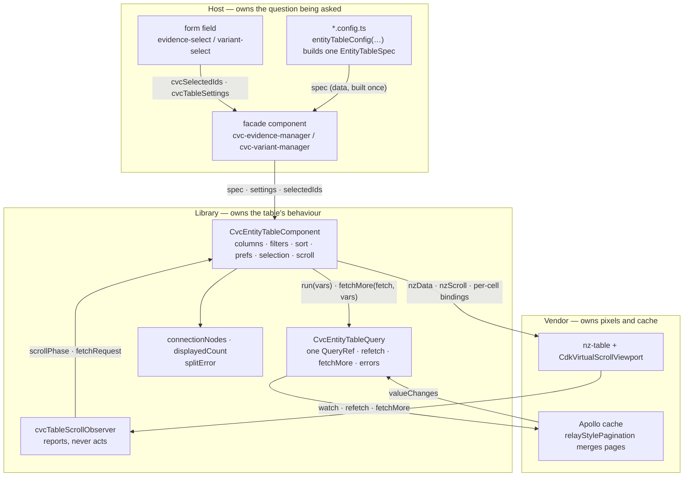
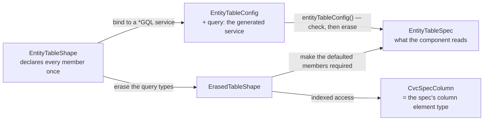
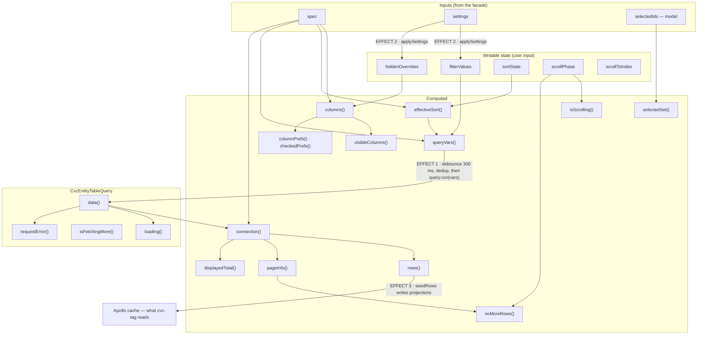
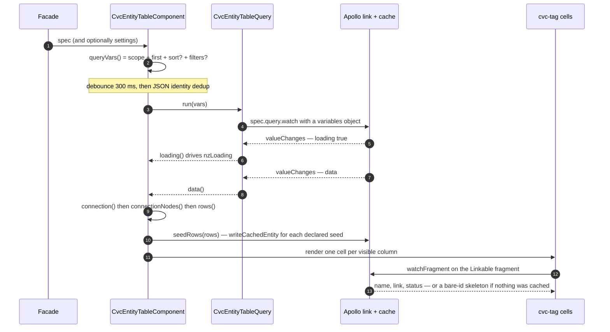
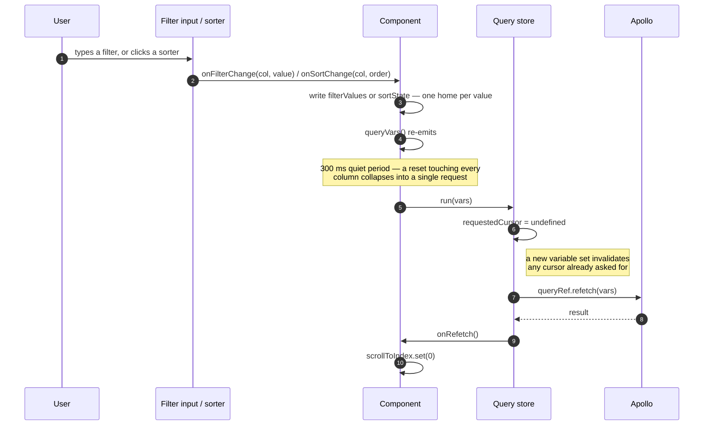
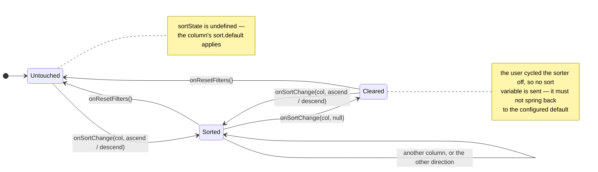
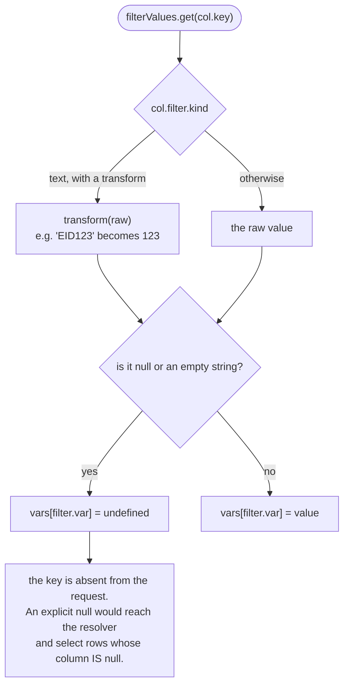
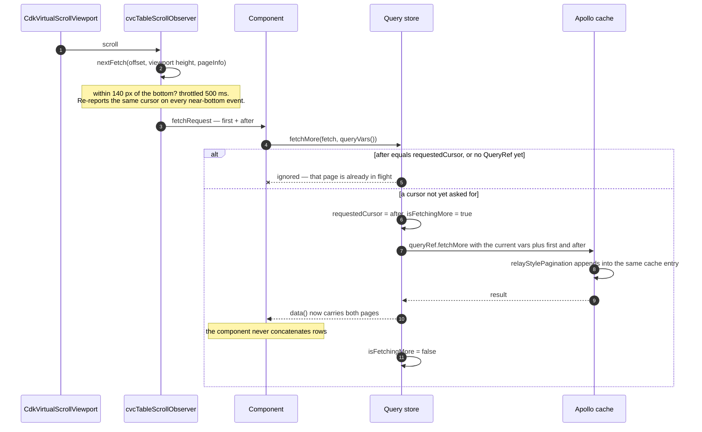
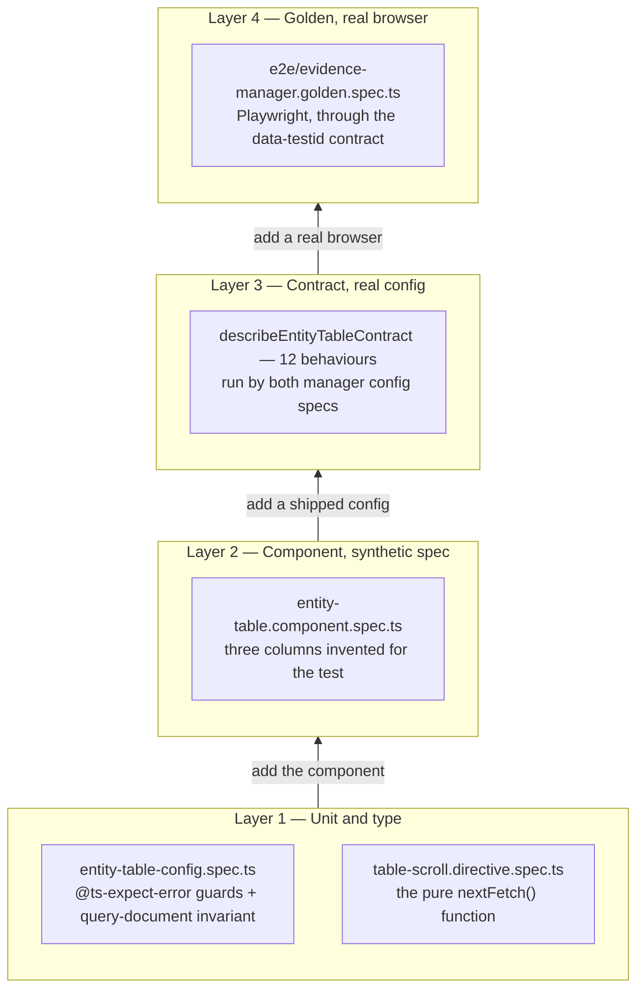
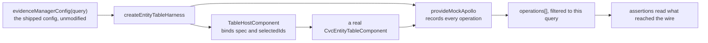

# cvc-entity-table — architecture

The entity table is one configurable, virtual-scrolled, server-driven table
component. A host describes its table as **data** — an `EntityTableSpec`
produced by `entityTableConfig()` — and renders `<cvc-entity-table
[spec]="spec()">`. Everything else (the query pipeline, filtering, sorting,
column preferences, selection, infinite scroll, error display) is owned by the
component and shared by every table built on it.

Two production tables consume it today, each through a thin **facade**
component:

- `cvc-evidence-manager` — `forms/types/evidence-select/evidence-manager/`
  (13 columns: entity tags, six enum tags, a text-tag, EID filter transform)
- `cvc-variant-manager` — `forms/types/variant-select/variant-manager/`
  (7 columns over denormalised `BrowseVariant` rows, with cache seeding)

The 17 browse tables under `views/` are the intended future consumers.

```
  form field (evidence-select / variant-select)
      │  [cvcSelectedIds] (cvcSelectedIdsChange) [cvcTableSettings]
      ▼
  facade (cvc-evidence-manager / cvc-variant-manager)
      │  translates field vocabulary → CvcTableSettings
      │  builds spec = entityTableConfig({ query, columns, … })
      ▼
  cvc-entity-table  ── owns QueryRef, filters, sort, prefs, selection
      │            ╲
      ▼             ╲ (reports up: selectedIdsChange)
  nz-table + cvcTableScrollObserver + filter widgets + cell renderers
```

## Contents

| Section                                                      | What it answers                                                          |
| ------------------------------------------------------------ | ------------------------------------------------------------------------ |
| [The pieces](#the-pieces)                                    | which file does what                                                     |
| [The layers](#the-layers)                                    | who is allowed to know what — plus the type erasure and the signal graph |
| [The component](#the-component)                              | what is on screen and what draws it; inputs; internal state              |
| [The column model](#the-column-model-entity-tabletypests)    | how one column is described                                              |
| [ng-zorro mapping](#how-the-column-model-maps-onto-ng-zorro) | which `CvcColumn` member becomes which vendor binding                    |
| [Configuration](#configuration-entity-table-configts)        | what `entityTableConfig()` checks, and what it cannot                    |
| [Runtime flows](#runtime-flows)                              | first query, filter/sort, infinite scroll, seeding, errors               |
| [The test layers](#the-test-layers)                          | what each layer of the suite can and cannot catch                        |

## The pieces

| File                                                  | Role                                                                                                                            |
| ----------------------------------------------------- | ------------------------------------------------------------------------------------------------------------------------------- |
| `entity-table.component.ts/.html/.less`               | The component: card chrome, toolbar, header/filter/body rows, all user-input state                                              |
| `entity-table-query.ts`                               | `CvcEntityTableQuery` — the QueryRef and everything derived from a response; the pipeline behind the component's variables      |
| `entity-table.types.ts`                               | The column model: `CvcColumn`, the `CvcCellSpec` union, filters, sort, settings types                                           |
| `entity-table-config.ts`                              | `entityTableConfig()` — type-checks a config literal against its query's generated types, then erases them to `EntityTableSpec` |
| `connection.types.ts`                                 | `CvcConnection<TNode>` (the common shape of all 42 `*Connection` types), `connectionNodes()`, `displayedCount()`                |
| `table-scroll.directive.ts`                           | `cvcTableScrollObserver` — scroll phase + next-page requests for the CDK virtual-scroll viewport                                |
| `filters/table-filter-input.component.ts`             | Text/numeric filter box in the filter row                                                                                       |
| `filters/enum-filter-menu.component.ts`               | The funnel-icon dropdown for enum filters                                                                                       |
| `enum-filter-options.ts`                              | `enumFilterOptions(Enum)` — filter options derived from a generated enum                                                        |
| `index.ts`                                            | Barrel; its doc names the consumer surface vs. internals                                                                        |
| `testing/entity-table.harness.ts` (in `app/testing/`) | `describeEntityTableContract` — the 12-behaviour contract every table must pass                                                 |

Rendering inside cells is delegated to the tag core: `cvc-tag`,
`cvc-tag-list`, `cvc-collection-tag` (`@app/tags`, cache-driven via
`watchFragment`), `cvc-attribute-tag` (enum values), and `cvc-empty-value`.

## The layers

The table is five layers deep, and each layer is allowed to know less than the
one above it. Most "where does this change belong?" questions are answered by
reading a change against this picture.



| Layer            | Knows                                                          | Must not know                           |
| ---------------- | -------------------------------------------------------------- | --------------------------------------- |
| config           | the generated query, its variables, its sort enum, its columns | that a component exists                 |
| facade           | the form field's vocabulary and the table's public inputs      | how rows are fetched                    |
| component        | the **erased** spec, and all user-input state                  | which entity, which query, which server |
| query store      | a `CvcTableQuery` and a bag of variables                       | columns, filters, sort, the DOM         |
| scroll directive | viewport geometry and the current `pageInfo`                   | the QueryRef, or that a query exists    |

Two directions are worth memorising: **configuration flows down** (a spec is
data, built once by a host) and **evidence flows up** (the directive reports,
the component decides, the store acts). Nothing in the library layer imports
anything from the host layer — `yarn check:cycles` proves it.

### The type layer

The generics exist to do one job: **type-check a config literal against its own
query, then forget the query.** That is two instantiations of a single member
declaration.

```ts
// The members, declared once, parameterised by the query types they touch.
interface EntityTableShape<TData, TVars, TNode, TSortColumn extends string> {
  title?: string
  connection(data: Maybe<TData>): Maybe<CvcConnection<TNode>>
  columns: CvcColumn<TNode, TVars, TSortColumn>[]
  sortVar?: keyof TVars & string
  pageSize?: number
  scope?: Partial<TVars>
}

// (1) BOUND — every parameter comes from the generated *GQL service.
interface EntityTableConfig<
  TQuery extends AnyQuery,
  TNode,
  TSortColumn extends string,
> extends EntityTableShape<
  QueryData<TQuery>,
  QueryVars<TQuery>,
  TNode,
  TSortColumn
> {
  query: TQuery
}

// (2) ERASED — the query types are gone; TNode survives.
type ErasedTableShape<TNode> = EntityTableShape<unknown, any, TNode, string>

interface EntityTableSpec<TNode> extends ErasedTableShape<TNode> {
  query: CvcTableQuery<unknown, Record<string, unknown>>
  // the three the factory defaults — required here rather than optional
  pageSize: number
  scope: Record<string, unknown>
  sortVar: string
}
```



Read concretely, for the evidence manager:

| Parameter     | In the config — **checked**                                                                    | On the spec — **erased**                    |
| ------------- | ---------------------------------------------------------------------------------------------- | ------------------------------------------- |
| `TQuery`      | `EvidenceManagerGQL`                                                                           | `CvcTableQuery` — the `watch`-only subset   |
| `TData`       | `EvidenceManagerQuery`, inferred from `TQuery`                                                 | `unknown`                                   |
| `TVars`       | `EvidenceManagerQueryVariables`                                                                | `any`                                       |
| `TNode`       | the `edges[].node` type (`EvidenceManagerFieldsFragment`), inferred from `connection`'s return | **survives** — it is the component's `TRow` |
| `TSortColumn` | `EvidenceSortColumns`, inferred from the `sort.column` members actually used                   | `string`                                    |

Three things follow, and they are the whole rationale:

- **Why erase.** The component is generic in exactly one parameter, `TRow`. It
  never uses the query's types: it copies `scope` into a variables bag, writes
  `sortVar` by name and reads `filter.var` by name. Carrying `TData`/`TVars`
  into the component would force every host to spell out type arguments and
  re-check the component per table, buying nothing.
- **Why `TVars` erases to `any` and not to a record type.** `keyof TVars` puts
  a filter's `var` in a **contravariant** position, so assigning a bound column
  to an erased one requires the erased `TVars` to be assignable _to_ an
  unresolved `QueryVars<TQuery>` — which only `any` satisfies. It reaches no
  value: every member it feeds (`sortVar`, a filter's `var`) resolves to
  `string`.
- **What is still asserted.** Two members, each for a reason the type system
  cannot be talked out of. `query`, because apollo-angular's `QueryRef` is
  invariant in both of its parameters, so a generated service satisfies no
  erased query surface however it is spelled. `scope`, because a generic
  variables type carries no implicit index signature, so `Partial<TVars>` never
  reaches `Record<string, unknown>`. Everything else — the columns,
  `connection`'s row type, `pageSize`, `sortVar` — is a checked assignment.
  Those two lines are the whole unchecked surface, and both carry the reason
  in a comment.

> **Reading a config type error.** Errors land on the member, not on the
> factory: a `filter.var` error names the query's variables, a cell-accessor
> error names `TRow`, a `sort.column` error names the generated `*SortColumns`
> enum. An error that mentions `EntityTableShape` itself means a member was
> added to the config and the spec's three redeclared members no longer line
> up — which is exactly what that inheritance is there to catch.

### The signal graph

Everything the component holds is a signal, and everything downstream of it is
a `computed`. The graph below is the component in one picture: values only ever
flow downward, and the three `effect()`s are the only places anything is
written rather than derived.



The three effects, and why each one is an effect rather than a `computed`:

1. **`queryVars` → `query.run(vars)`** — issuing a request is a side effect,
   and it is debounced (300 ms) and deduplicated by `JSON.stringify` first.
2. **`settings` → `applySettings`** — a host writes _into_ the component's own
   filter and visibility state, so the write direction is inward.
3. **`rows` → `seedRows`** — writes entity projections into the Apollo cache so
   the tags in those rows can resolve.

Each wraps its write in `untracked()`, so no effect can re-trigger itself.

## The component

```ts
export class CvcEntityTableComponent<TRow extends { id: number }>
```

`TRow` is the connection's node type. **`id: number` is required** — selection
(`selectedIds`, `isSelected`) and virtual-scroll row tracking key on it.

### What you see, and what draws it

One card, one `nz-table`, three row bands. Every numbered region below is a
single template block — there is exactly one `th` for headers, one `th` for
filters and one `td` for cells, because layout lives on the column and only the
cell's _contents_ vary by kind.

```
┌─ nz-card.cvc-entity-table ───────────────────────────────────────────────────────┐
│ (1) spec().title                        (2)[Loading...]  (3)[No more rows]       │
│                    (4)[! Query Error]   (5) 50 of 1,284 displayed  (6)[R](7)[C]  │
├──────────────────────────────────────────────────────────────────────────────────┤
│ (8) nz-table   nzScroll = { x: '800px', y: height() ?? '100%' }                  │
│ ┌──────────────────────────────────────────────────────────────────────────────┐ │
│ │ (9) thead > tr.col-header-row        @for (col of visibleColumns())          │ │
│ │  [ ] | EID        ^v | Molecular Profile ^v | Disease ^v | ... | Status ^v   │ │
│ │  |<- fixed:'left' ->|                                  |<- fixed:'right' ->| │ │
│ ├──────────────────────────────────────────────────────────────────────────────┤ │
│ │ (10) thead > tr.filter-row           one control per col.filter.kind         │ │
│ │      | [EID____]    | [_____________]      | [_______]  | ... | (11) [v]     │ │
│ ├──────────────────────────────────────────────────────────────────────────────┤ │
│ │ (12) tbody > cdk-virtual-scroll viewport      nzVirtualItemSize = 28         │ │
│ │  [x] | EID123       | * BRAF V600E         | * Melanoma | ... | * accepted   │ │
│ │  [ ] | EID124       | * BRAF V600K         | * Glioma   | ... | * submitted  │ │
│ │  [ ] | EID125       | ...                                                    │ │
│ │                                    (13) scroll -> cvcTableScrollObserver     │ │
│ └──────────────────────────────────────────────────────────────────────────────┘ │
└──────────────────────────────────────────────────────────────────────────────────┘
```

|  #  | Region             | Template anchor                            | Driven by                                                           |
| :-: | ------------------ | ------------------------------------------ | ------------------------------------------------------------------- |
|  1  | Card title         | `#cardTitle` → `[nzTitle]`                 | `spec().title`                                                      |
|  2  | "Loading…" tag     | `#toolbar` → `[nzExtra]`                   | `isFetchingMore()` — a page being appended, not the first load      |
|  3  | "No more rows" tag | `#toolbar`                                 | `noMoreRows()` — phase `'bottom'` **and** `hasNextPage === false`   |
|  4  | Error tags         | `#toolbar`                                 | `requestError()`, split by `splitError` into query vs. network      |
|  5  | Row count          | `data-testid="row-count"`                  | `rows().length` of `displayedTotal()`                               |
|  6  | Reset filters      | `data-testid="filter-reset"`               | `onResetFilters()` — filters + sort, never visibility               |
|  7  | Visible columns    | `data-testid="column-prefs-trigger"`       | `columnPrefs()` / `checkedPrefs()` / `onPrefsChange()`              |
|  8  | Scroll region      | `[nzScroll]` on `nz-table`                 | `height()` input; `'100%'` resolves through the flex chain          |
|  9  | Header row         | `thead > tr.col-header-row`                | `visibleColumns()`; sorters via `sortOrderFor()` / `onSortChange()` |
| 10  | Filter row         | `thead > tr.filter-row`                    | `filterValue(col.key)` / `onFilterChange()`                         |
| 11  | Enum filter menu   | `cvc-enum-filter-menu` (funnel trigger)    | `col.filter.options`, typed by `CvcEnumOption`                      |
| 12  | Body               | `tbody` + `ng-template nz-virtual-scroll`  | `rows()`, tracked by `trackById`                                    |
| 13  | Scroll reporting   | `cvcTableScrollObserver` on the `nz-table` | `(scrollPhase)` and `(fetchRequest)` outputs                        |

The `|<- fixed ->|` brackets in the header band are ng-zorro's own boolean
`nzLeft`/`nzRight` pinning: a hidden measure row supplies the widths and the
table writes each cell's offset and edge-shadow class itself. This works
**only because the body's `nz-virtual-scroll` template is not wrapped in a
`<tbody>`** — see troubleshooting §11 for the trap.

### Inputs / outputs

| Binding           | Type                               | Notes                                                                               |
| ----------------- | ---------------------------------- | ----------------------------------------------------------------------------------- |
| `[spec]`          | `EntityTableSpec<TRow>` (required) | Produce only via `entityTableConfig()`                                              |
| `[(selectedIds)]` | `number[]` (model)                 | The **complete** selection on every change, not a delta. Emits `selectedIdsChange`. |
| `[settings]`      | `CvcTableSettings`                 | Externally-driven filters + column visibility (see "Settings injection")            |
| `[height]`        | `string` (CSS length)              | Omit to fill available space via the flex chain; set for a fixed-height region      |
| `[titleTemplate]` | `TemplateRef<void>`                | Replaces the card title's plain `spec().title` text (icons, links)                  |

The component also projects one content slot: host elements marked
`cvcTableToolbarExtra` land in the card-extra toolbar row, between the row
counts and the reset/preferences buttons — where the browse tables put their
downloaders and scope menus.

There are no other outputs: filters, sort and preferences are internal state;
the observable consequence of all of them is the query the table sends.

### Internal state (all signals)

- `filterValues: Map<columnKey, unknown>` — the **single home** of every
  filter's value. The query variables and the filter inputs both read it,
  which is why reset cannot desynchronise them.
- `sortState: Maybe<CvcSortState>` — three states, deliberately:
  `undefined` = untouched (column `sort.default` applies); `{key, order}` =
  user sort; `{key, order: null}` = user cleared the sort, which must _not_
  spring back to the default.
- `hiddenOverrides: Map<columnKey, boolean>` — visibility overrides from the
  prefs panel or `settings`, layered over each column's declared `hidden`.
- `scrollPhase`, `scrollToIndex`.
- Response state — `data`, `loading`, `isFetchingMore`, `requestError` — lives
  on `CvcEntityTableQuery`, which the component holds as `query` and re-exposes
  under the names the template binds.

Derived: `columns` (spec + overrides), `visibleColumns` (pinned-column
offsets are not derived here — they are ng-zorro's own boolean
`nzLeft`/`nzRight` measurement; see troubleshooting §11 for the `<tbody>`
trap that breaks it),
`queryVars`, `connection` → `rows` / `pageInfo` / `displayedTotal`,
`selectedSet`.

## The column model (`entity-table.types.ts`)

One flat `CvcColumn<TRow, TVars, TSortColumn>` per column. Layout
(`width`/`align`/`fixed`/`hidden`/`tooltip`/`omitFromPrefs`/`emptyValue`)
lives on the column; only the cell contents vary by `cell.kind`, so the
template has exactly one `<th>` for headers, one for filters, and one `<td>`.

Cell kinds (`CvcCellSpec<TRow>` union):

| kind            | renders                                           | key fields                                                                                                                                              |
| --------------- | ------------------------------------------------- | ------------------------------------------------------------------------------------------------------------------------------------------------------- |
| `select`        | row checkbox                                      | — (the table owns the selection)                                                                                                                        |
| `entity-tag`    | `cvc-tag` / `cvc-tag-list` + `cvc-collection-tag` | `ref(row)` (single, list or nothing), `seed(row)` (cache projection for denormalised rows), `maxTags`, `truncateLabel`, `fullWidth`, `popoverPlacement` |
| `enum-tag`      | `cvc-attribute-tag`                               | `value(row)` — the raw enum value/number, `tooltip(row)`                                                                                                |
| `text-tag`      | icon tag, full text in tooltip                    | `text(row)`                                                                                                                                             |
| `text`          | plain text with filter-match highlighting         | `text(row)` (string, number or list), `highlight`                                                                                                       |
| `external-link` | `cvc-link-tag` to an off-site URL                 | `href(row)`, `text(row)` (falls back to the href), `tooltip`, `iconName`                                                                                |
| `custom`        | polymorpheus content declared in the config       | `content` — handler `(ctx) => string`, component, or TemplateRef; typed `CvcCellContext<TRow>`                                                          |

Every kind reads through an **accessor** (`ref`/`value`/`text`) checked
against `TRow` — a column's data need not share its key, and there is no
untyped `row[col.key]` indexing anywhere.

Filters (`CvcColumnFilter<TVars>` union): `text` (with optional `transform`
normaliser and `entityTypename` for id→name resolution), `numeric`, `enum`
(options usually from `enumFilterOptions(GeneratedEnum)`). Every filter's
`var` is `keyof TVars & string` — a filter cannot name a variable the query
does not declare.

Sort (`CvcColumnSort<TSortColumn>`): `column` is a member of the query's
generated `*SortColumns` enum; `default` seeds the initial sort; `disabled`
shows no sorter.

## How the column model maps onto ng-zorro

`CvcColumn` is largely a typed facade over `nz-table`'s per-cell directive
inputs — the config describes once what the old templates re-bound in every
`th`/`td` block. When debugging rendering, this is the translation table
(bindings applied in `entity-table.component.html`):

| `CvcColumn` member                   | ng-zorro binding / type                                                                                                    | Notes                                                                                                                                                                                                                                                                                                                                                                |
| ------------------------------------ | -------------------------------------------------------------------------------------------------------------------------- | -------------------------------------------------------------------------------------------------------------------------------------------------------------------------------------------------------------------------------------------------------------------------------------------------------------------------------------------------------------------- |
| `key`                                | `[nzColumnKey]` on `th`                                                                                                    | also the `data-column` test hook                                                                                                                                                                                                                                                                                                                                     |
| `width`                              | `[nzWidth]` on `th`                                                                                                        | px strings recommended — they seed the colgroup; the measured widths drive the pinned offsets                                                                                                                                                                                                                                                                        |
| `align`                              | `[nzAlign]` on `th`/`td`                                                                                                   | `'left' \| 'center' \| 'right'`, same union                                                                                                                                                                                                                                                                                                                          |
| `fixed: 'left'/'right'`              | `[nzLeft]` / `[nzRight]` (`NzCellFixedDirective`)                                                                          | booleans, so ng-zorro's own measure row computes the offsets and applies the edge-shadow classes (`ant-table-cell-fix-left-last`, `ant-table-cell-fix-right-first`). Depends on the template NOT wrapping the virtual-scroll body in `<tbody>` — a wrapper becomes a detached measure row that reports all widths as 0 and zeroes every offset (troubleshooting §11) |
| `sort.default`, `CvcSortState.order` | `NzTableSortOrder` (`'ascend' \| 'descend' \| null`)                                                                       | imported directly from `ng-zorro-antd/table` — our sort state speaks ng-zorro's vocabulary and translates to the generated `SortDirection` only at the query boundary                                                                                                                                                                                                |
| `sort` presence                      | `[nzShowSort]`, `[nzSortFn]`, `[nzSortOrder]`, `(nzSortOrderChange)`                                                       | `nzSortFn` is set to `true` (server-side contract: "don't sort locally"); actual sorting is the `sortBy` query variable                                                                                                                                                                                                                                              |
| `sort.directions`                    | `[nzSortDirections]`                                                                                                       | the click-cycle order; omitted, ng-zorro's ascend-first default applies. Count/score columns declare `SORT_DESCEND_FIRST` — the order every legacy browse table gave them                                                                                                                                                                                            |
| `filter` (enum)                      | `nz-filter-trigger` + `nz-dropdown-menu`                                                                                   | deliberately **not** `[nzFilters]`/`NzTableFilterList`, which types option values as `any`; `CvcEnumOption<TValue>` carries the generated enum through and the menu maps to ng-zorro at the boundary                                                                                                                                                                 |
| `filter` (text/numeric)              | plain `nz-input` / `nz-input-number` in a second `thead` row                                                               | ant expects the filter row inside `thead`                                                                                                                                                                                                                                                                                                                            |
| `hidden` / prefs panel               | `nz-checkbox-group` `[nzOptions]`                                                                                          | `columnPrefs()` produces exactly ng-zorro 22's `NzCheckboxOption` shape (`{label, value}`); checked values ride `ngModel` separately (the v22 API split)                                                                                                                                                                                                             |
| — (table level)                      | `[nzScroll]="{ x, y }"`, `[nzVirtualItemSize]="28"`, `[nzVirtualForTrackBy]`, `[nzFrontPagination]="false"`, `[nzLoading]` | `nzScroll.y` is written verbatim to the CDK viewport's `style.height`, which is why `'100%'` + the flex chain works                                                                                                                                                                                                                                                  |

Similarly, `CvcTableQuery` is a structural facade over apollo-angular's
generated `Query` service (over `watch` rather than `fetch`), and the scroll
directive is a reporting wrapper around ng-zorro's embedded
`CdkVirtualScrollViewport` (`measureScrollOffset`, `checkViewportSize`,
`scrollToIndex`, `renderedRangeStream`).

## Configuration (`entity-table-config.ts`)

```ts
export function evidenceManagerConfig(query: EvidenceManagerGQL) {
  return entityTableConfig({
    title: 'Use checkboxes to select or deselect Evidence Items',
    query, // the generated *GQL service
    pageSize: 50, // sent as `first` on EVERY query
    connection: (data) => data?.evidenceItems, // picks the connection
    // scope: { assertionId: 7 },            // always-sent, non-user variables
    // sortVar: 'sortBy',                    // the default
    columns: [
      /* CvcColumn literals */
    ],
  })
}
```

`entityTableConfig()` infers `TData`/`TVars` from the GQL service,
`TNode` from `connection`'s return, and `TSortColumn` from the sort members
used — so the literal is fully type-checked with **zero explicit type
arguments** — then erases the query types so the component carries only
`TRow`. It also throws in dev mode on duplicate column keys (keys address
columns in prefs, filters and the `data-testid` contract, so
a duplicate is a silent aliasing bug).

Three type-level guarantees, all pinned by self-enforcing `@ts-expect-error`
assertions in `entity-table-config.spec.ts` (an _unused_ `@ts-expect-error`
is itself a compile error, so they cannot rot):

1. `filter.var` must be a declared query variable.
2. Cell accessors must exist on `TRow`.
3. `sort.column` must be a `*SortColumns` member.

What types cannot see — a variable that is _declared but never passed to a
field_ — is covered by a runtime invariant in each manager's config spec,
which walks the query document and requires every filter variable to be
declared **and** used. (That is the exact shape of the historical
`evidenceRating`/`$rating` bug.)

`EntityTableSpec` inherits its members from the same declaration the config
uses, instantiated with the query types erased, so a member added to a config
cannot go missing from the shape the component reads. Two members are asserted
rather than assigned — `query` and `scope` — for the reasons set out in
[the type layer](#the-type-layer).

## Runtime flows

### Initial query

1. `queryVars` (computed) assembles `{...scope, first: pageSize}` + the
   effective sort (`sortState ?? defaultSort`, translated through
   `sort.column` and the generated `SortDirection`) + one entry per filter
   column (transform applied; `null`/`''` become `undefined` so a cleared
   filter is an **absent** variable, never an explicit null).
2. The vars stream is debounced **300 ms** (`QUERY_DEBOUNCE_MS` — collapses
   keystrokes and the one-change-per-column storm of a reset) and deduplicated
   by `JSON.stringify` (`queryVars` builds a fresh object per read, so
   identical variable sets would otherwise re-emit — this is what stops a
   host's mount-time `settings` push from issuing a duplicate opening query).
3. First emission reaches `CvcEntityTableQuery.run(vars)`, which opens the one
   QueryRef: `spec.query.watch({ variables })` — an **options object**, never
   positional (see troubleshooting §1) — and a single `valueChanges`
   subscription feeds its `result`.
4. `loading()` is true until the first response, so first paint is a spinner.



The last three steps are why cache seeding exists: a tag never reads its row,
only the cache, so a denormalised row must be projected back into the cache
before its tags paint.

### Filter / sort / prefs changes

- `onFilterChange(col, value)` writes `filterValues` — the same map the
  filter inputs and text-highlighting read.
- `onSortChange(col, order)` always writes a state (even `order: null`), so
  "cleared" and "never sorted" stay distinct. One sort at a time.
- `onPrefsChange(visibleKeys)` rewrites `hiddenOverrides`; `omitFromPrefs`
  columns (the select column) never appear in the panel and are never hidden
  by it.
- `onResetFilters()` = `filterValues.set(new Map())` +
  `sortState.set(undefined)`. Sort returns to the configured default;
  visibility is deliberately untouched.
- Any resulting variable change flows through the same debounced pipeline into
  `CvcEntityTableQuery.run(vars)` → `queryRef.refetch(vars)` (positional — the
  API differs from `watch`), which also clears the in-flight cursor guard and
  calls back so the component scrolls to row 0.



**Sort is three-valued, not two.** "Never sorted" and "sorted, then cleared"
must send different queries, and only `onResetFilters` produces the former.



**How a filter value becomes a query variable.** `queryVars()` walks every
column with a `filter`; the empty cases are the interesting ones.



### Infinite scroll / fetchMore

`cvcTableScrollObserver` sits on the `nz-table` and **reports rather than
acts**:

- `(scrollPhase)`: `'scroll'` (throttled 250 ms) → `'stop'` (300 ms debounce)
  → the component's `isScrolling()` suspends tag popovers and tooltips while
  a gesture is in flight; `'bottom'` + `hasNextPage === false` shows the
  "No more rows" tag.
- `(fetchRequest)`: when the current offset is within `targetHeight`
  (140 px) of the bottom, throttled 500 ms, it emits
  `{ first: fetchCount, after: endCursor }` via the pure `nextFetch()`
  helper. Bottom detection reads the **current** offset — no `pairwise()` —
  so a single-motion scrollbar drag to the end still fires.
- The directive re-reports the same cursor on repeated near-bottom events.
  **Dedup is the component's job** (`onFetchRequest`): it ignores a cursor
  already in flight and resets that guard when a refetch replaces the
  variables — only the QueryRef's owner can know a cursor went stale, and
  relay cursors are positional, so a post-refetch first page routinely ends
  on the same cursor string.
- `fetchMore({ variables: { ...queryVars(), ...fetch } })` carries the
  current filters and sort; Apollo's `relayStylePagination` policy — keyed on
  **all** the query's arguments in `graphql.type-policies.ts` — appends the
  page into the same cache entry. The component never concatenates rows.



The `alt` branch is the whole reason the guard lives in the store rather than
the directive: the directive cannot know that a refetch made a cursor stale,
and relay cursors are positional, so a post-refetch first page routinely ends
on the same cursor string it ended on before.

The directive also owns viewport measurement: CDK measures once at first
render (typically before the flex chain has sized the container), so a
`ResizeObserver` on the viewport and its parent triggers rAF-coalesced
`checkViewportSize()` calls. Sizing itself is pure CSS — `nzScroll.y: '100%'`
resolves through the `min-height: 0` flex chain in
`entity-table.component.less`; nothing computes a pixel height in JS.

### Row pipeline and cache seeding

`result → spec.connection(data) → connectionNodes()` (drops null edges)
`→ rows()`. `displayedTotal()` prefers `filteredCount` over `totalCount`
because on `Browse*` connections `totalCount` ignores the filters entirely
(see `connection.types.ts` for the full 42-connection audit).

An effect passes each arriving page to `seedRows`: every `entity-tag` column
declaring `seed(row)` has its projection written with `writeCachedEntity`,
which satisfies the typename's `Linkable*` fragment and **refuses to
overwrite** an entity a real query already cached. This exists for
denormalised `Browse*` rows (e.g. `BrowseVariant` carries
`featureId`/`featureName`/… as scalars, so no `Feature:<id>` entity would
otherwise ever exist and tags would render as `#<id>` skeletons). Queries
returning real nested entities (the evidence manager) spread `Linkable*`
fragments instead and need no seeds.

### Settings injection (host-driven filters and visibility)

`[settings]: CvcTableSettings = { filters?: CvcFilterChange[], preferences?:
CvcColumnPref[] }`. `applySettings` merges filters into `filterValues` and
preferences into `hiddenOverrides`. One subtlety: a text filter declaring
`entityTypename` is _driven by entity id_ but _filters by name_ — the id is
resolved to a display name synchronously out of the Apollo cache
(`readCachedEntityName`); an entity never cached is skipped rather than
guessed at.

The facades translate between vocabularies at this boundary. The evidence
facade accepts the field's existing shape (`preferences` as
`{value, checked}`) so `evidence-select.type.ts` needed no edits, and gates
preference application behind `cvcApplyColumnPreferences` (default **off** —
auto-showing a required sibling's column is a rejected feature kept testable
as a switch). On the field side, `connectTableSettings()` in
`evidence-select.type.ts` builds the payload as a `computed` over the form
state's signals, mapping sibling fields to columns via
`SYNCHRONIZED_FIELD_TO_COL` and required-flags via `REQUIRED_FIELD_TO_COL`.

### Selection

The `select` cell kind renders a checkbox bound to `isSelected(row)`
(an `O(1)` lookup in a `Set` derived from `selectedIds`).
`onRowSelectedChange` emits the complete id set. The facades forward this as
`[cvcSelectedIds]` / `(cvcSelectedIdsChange)` — the frozen contract the form
fields bind.

### Errors

`splitError` (in `entity-table-query.ts`) separates Apollo 4's single
`ErrorLike` into GraphQL errors and transport errors so the toolbar can label
them differently. Errors from
imperative `refetch`/`fetchMore` do **not** surface on `valueChanges`
(apollographql/apollo-client#6857), so each promise's result is inspected
too.

## The test layers

The suite mirrors the architecture: each layer admits one more piece of reality
than the layer below it, and each is aimed at the failures that only become
visible once that piece is present.



| Layer         | Runs in                      | Sees                                 | Catches                                                                                                                                             | Cannot catch                                     |
| ------------- | ---------------------------- | ------------------------------------ | --------------------------------------------------------------------------------------------------------------------------------------------------- | ------------------------------------------------ |
| 1 Unit / type | `tsc` + vitest               | one function or one type             | a filter naming an undeclared variable; a variable declared but never used in the document; bottom-detection arithmetic                             | anything about wiring                            |
| 2 Component   | vitest + jsdom               | the component, synthetic spec        | variable routing, transforms, sort states, reset, prefs, selection, fetchMore dedup                                                                 | whether a **real** config is wired correctly     |
| 3 Contract    | vitest + jsdom + a mock link | a shipped config in a real component | every filterable column reaching its declared variable; every sortable column reaching the sort variable; fetchMore carrying filters; cache seeding | anything that needs layout                       |
| 4 Golden      | Playwright, real Chrome      | the shipped app                      | rendering, virtual scroll, popovers, pinned-column offsets and edge shadows                                                                         | fast feedback — it is the slowest and last layer |

**Why layer 3 exists at all.** Layers 1 and 2 can both be green while a table
is broken, because neither one ever mounts a real config. The contract does,
and it asserts on **what reaches the Apollo link** rather than on what
`queryVars` computes — the two came apart once and nothing noticed.



**Coverage is derived, not enumerated.** The contract never names a column. It
loops over whatever the config declares, so adding a filterable column to a
manager adds an assertion to that manager's contract run for free — and
forgetting to wire it fails without anyone editing a test.

| #   | Behaviour                                                  | Coverage                            |
| --- | ---------------------------------------------------------- | ----------------------------------- |
| 1   | opens with a single query carrying its page size and scope | fixed                               |
| 2   | does not re-query when the variables come out identical    | fixed                               |
| 3   | routes every filterable column to the variable it declares | **every** filterable column         |
| 4   | sends the generated sort column for every sortable column  | **every** sortable column           |
| 5   | omits a cleared filter rather than sending null            | skips without a usable text filter  |
| 6   | reset clears the query and the filter inputs together      | skips without a usable text filter  |
| 7   | carries the current filters and sort into a fetchMore      | fixed                               |
| 8   | emits the complete selection whenever a row is toggled     | fixed                               |
| 9   | hides a column through prefs, but never a pinned one       | skips if every column is pinned     |
| 10  | labels preference entries with the tooltip                 | skips without a tooltip column      |
| 11  | seeds the cache for every column that declares how         | **every** seeding column            |
| 12  | emphasises the active filter in a highlighting column      | skips without a highlighting column |

**Inapplicable is not the same as passing.** A behaviour a config cannot
exercise calls `ctx.skip(reason)`, so the runner prints it as skipped instead
of green. Today two skips are expected and both are real: the evidence manager
declares no highlighting column (12) and the variant manager declares no column
tooltips (10) — each behaviour is covered by the other manager. A skip count
that grows is a config that quietly stopped being tested.

**Rows are never asserted below layer 4.** The body is a `cdk-virtual-scroll`
viewport, which measures real layout and renders nothing in jsdom — the same
reason `table-scroll.directive.spec.ts` tests its pure `nextFetch` rather than
the directive. Row-level behaviour lives in the Playwright goldens, which
address the table through the `data-testid` contract (`entity-table`, `row`,
`column-header`, `column-filter`, `row-count`, `filter-reset`,
`column-prefs-trigger/-panel`, all carrying `data-column`/`data-row-id`).

One trap worth knowing at every jsdom layer: ant's icon service throws on an
unregistered icon name **outside** the test's call stack, which leaves
assertions passing while the runner reports a flood of unhandled errors. That
is what `TABLE_ICONS` in the harness is for; import it rather than re-declaring
the list.

See `02-authoring-guide.md` for how to build and modify tables, and
`03-troubleshooting.md` for the gotchas.
